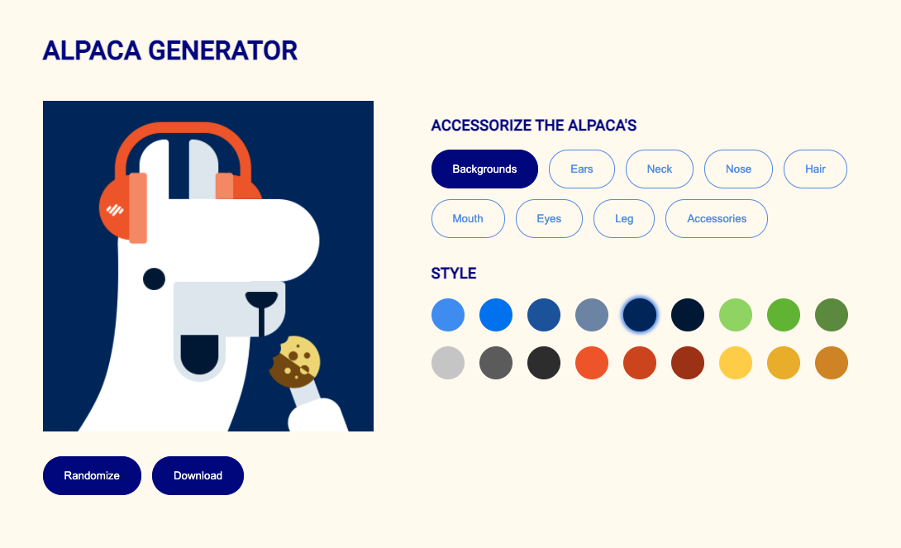

# CodeMentor DevProjects - Alpaca Image Generator Website

## Table of contents

- [Overview](#overview)
  - [The challenge](#the-challenge)
  - [Screenshot](#screenshot)
  - [Links](#links)
  - [Built with](#built-with)

## Overview

### The challenge

Users should be able to:

- Customize/Randomize their own alpaca profile picture
- Download the customized alpaca picture

### Screenshot

### Links

- Solution URL: [Add solution URL here](https://your-solution-url.com)
- Live Site URL: [Add live site URL here](https://your-live-site-url.com)

## My process

### Built with

- Semantic HTML5 markup
- CSS custom properties
- Mobile-first workflow
- [React](https://reactjs.org/) - JS library

